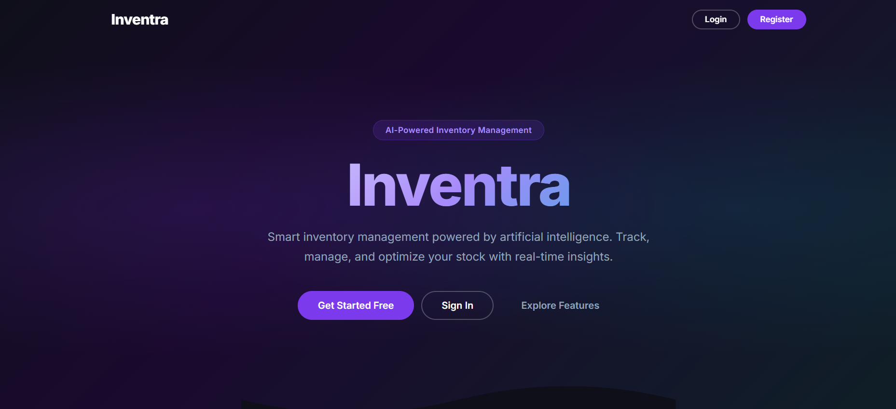
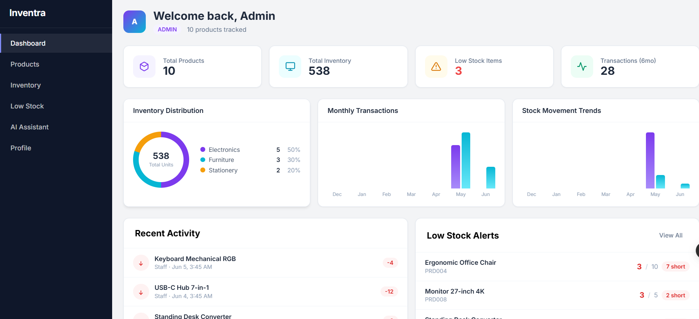
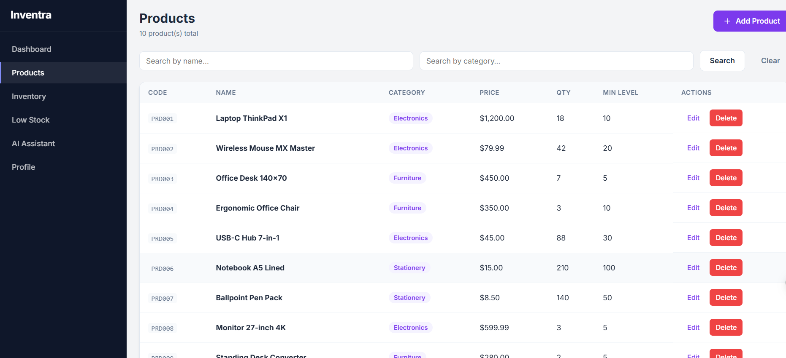
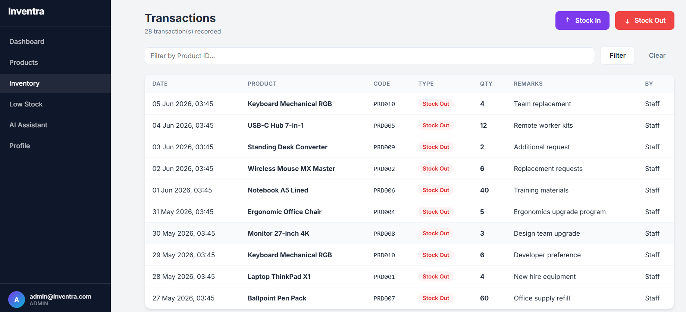

# Inventra – AI-Powered Inventory Management System

[](https://spring.io/projects/spring-boot)
[](https://angular.dev)
[](https://www.postgresql.org/)
[](https://redis.io/)
[](https://railway.app)
[](https://inventra-ai-poweredinventorysystem-production.up.railway.app)

**Live Demo:** [https://inventra-ai-poweredinventorysystem-production.up.railway.app](https://inventra-ai-poweredinventorysystem-production.up.railway.app)

Intelligent inventory management powered by AI. Track stock levels, manage products, and get actionable insights through natural language queries.

## Features

- **Dashboard** — Real-time inventory overview with key metrics and low-stock alerts
- **Product Management** — CRUD operations with pagination, sorting, and filtering
- **Stock Transactions** — Stock-in and stock-out with complete audit trail
- **Low-Stock Alerts** — Automatic detection of products below minimum stock levels
- **AI Assistant** — Natural language queries powered by Google Gemini AI
- **Role-Based Access** — Admin and Staff roles with granular permissions
- **JWT Authentication** — Secure token-based authentication with session persistence
- **Responsive UI** — Modern Angular frontend with loading skeletons and empty states

## Tech Stack

| Layer       | Technology                                              |
|-------------|---------------------------------------------------------|
| Frontend    | Angular 21, TypeScript, SCSS, RxJS                      |
| Backend     | Java 21, Spring Boot 3.3.5, Spring Security, Spring Data JPA |
| Database    | PostgreSQL (primary), Redis (caching)                   |
| AI          | Google Gemini API                                       |
| Auth        | JWT (jjwt 0.12.5), BCrypt                               |
| Build       | Maven, Docker                                           |
| Deploy      | Railway                                                 |

## Architecture

```
┌─────────────────────────────────────────────────────────────┐
│                     Browser (Angular)                       │
│  ┌─────────┐ ┌──────────┐ ┌──────────┐ ┌─────────────┐   │
│  │ Dashboard│ │ Products │ │Inventory │ │ AI Assistant │   │
│  └─────────┘ └──────────┘ └──────────┘ └─────────────┘   │
└───────────────────────┬─────────────────────────────────────┘
                        │ HTTP / JWT
┌───────────────────────▼─────────────────────────────────────┐
│              Spring Boot REST API (Port 8080)                │
│  ┌──────────┐ ┌──────────┐ ┌──────────┐ ┌──────────────┐  │
│  │ Auth API │ │ Product  │ │Inventory │ │ AI Chat API  │  │
│  │ /api/auth│ │ /api/prod│ │ /api/inv │ │ /api/ai      │  │
│  └──────────┘ └──────────┘ └──────────┘ └──────────────┘  │
│  ┌──────────────────────────────────────────────────────┐  │
│  │  Service Layer + JPA Repositories                    │  │
│  └──────────────────────────────────────────────────────┘  │
└────────────┬───────────────────────────────────┬────────────┘
             │                                   │
      ┌──────▼──────┐                    ┌───────▼───────┐
      │  PostgreSQL  │                    │    Redis      │
      │  (Railway)   │                    │   (Caching)   │
      └──────────────┘                    └───────────────┘
```

## Screenshots

| Screen               | Preview                                    |
|----------------------|--------------------------------------------|
| Main Page            |      |
| Dashboard            |     |
| Products List        |    |
| Inventory            |  |

## Getting Started

### Prerequisites

- Java 21+
- Node.js 20+
- PostgreSQL 15+
- Maven 3.9+

### Local Development

1. **Clone the repository**
   ```bash
   git clone https://github.com/chetana987/Inventra-AI-Powered_Inventory_System.git
   cd Inventra-AI-Powered_Inventory_System
   ```

2. **Set up environment variables**
   ```bash
   cp .env.example .env
   # Edit .env with your PostgreSQL credentials and JWT secret
   ```

3. **Start the backend**
   ```bash
   ./mvnw spring-boot:run -Dspring-boot.run.profiles=dev
   ```

4. **Start the frontend** (in a separate terminal)
   ```bash
   cd frontend
   npm install
   ng serve
   ```

5. Open `http://localhost:4200`

### Default Credentials

| Role  | Email              | Password   |
|-------|--------------------|------------|
| Admin | admin@inventra.com | Admin@123  |
| Staff | staff@inventra.com | Staff@123  |

## Docker Deployment

Build and run with Docker Compose:

```bash
docker-compose up -d
```

The app will be available at `http://localhost:8080`.

## Railway Deployment

This project is configured for one-click deployment on Railway:

1. Push to your GitHub repository
2. Connect the repository in Railway
3. Add a PostgreSQL plugin (env vars are auto-linked)
4. Set required environment variables:
   - `JWT_SECRET` — Base64-encoded 256-bit key
   - `GEMINI_API_KEY` — Google Gemini API key (optional)
5. Deploy — Railway auto-detects the Dockerfile

## API Endpoints

| Method | Endpoint                 | Auth Required | Description            |
|--------|--------------------------|---------------|------------------------|
| POST   | `/api/auth/register`     | No            | Register new user      |
| POST   | `/api/auth/login`        | No            | Login                  |
| GET    | `/api/products`          | Yes           | List products (paginated) |
| GET    | `/api/products/{id}`     | Yes           | Get product by ID      |
| POST   | `/api/products`          | Admin         | Create product         |
| PUT    | `/api/products/{id}`     | Admin         | Update product         |
| DELETE | `/api/products/{id}`     | Admin         | Delete product         |
| POST   | `/api/inventory/stock-in`| Yes           | Record stock-in        |
| POST   | `/api/inventory/stock-out`| Yes          | Record stock-out       |
| GET    | `/api/inventory/history` | Yes           | Get transaction history|
| POST   | `/api/ai/query`          | Yes           | AI natural language query |
| GET    | `/api/health`            | No            | Health check           |

## Project Structure

```
├── frontend/                    # Angular SPA
│   ├── src/app/
│   │   ├── components/          # Reusable UI components
│   │   ├── guards/              # Route guards (auth)
│   │   ├── interceptors/        # HTTP interceptors (JWT, timeout)
│   │   ├── models/              # TypeScript interfaces
│   │   ├── pages/               # Page components
│   │   └── services/            # API service classes
│   └── Dockerfile
├── src/                         # Spring Boot backend
│   ├── main/java/com/inventra/
│   │   ├── config/              # App configuration, DataSeeder
│   │   ├── controller/          # REST controllers
│   │   ├── dto/                 # Request/Response DTOs
│   │   ├── entity/              # JPA entities
│   │   ├── exception/           # Global exception handler
│   │   ├── repository/          # JPA repositories
│   │   ├── security/            # JWT auth, SecurityConfig
│   │   └── service/             # Business logic
│   └── main/resources/          # Application configs
├── Dockerfile                   # Multi-stage Docker build
├── docker-compose.yml           # Local Docker setup
├── pom.xml                      # Maven build
└── .env.example                 # Environment template
```

## Contribution

**Chetana Mahajan** — Full-stack development, system architecture, design, testing, and deployment.

## License

This project is for educational and demonstration purposes.
